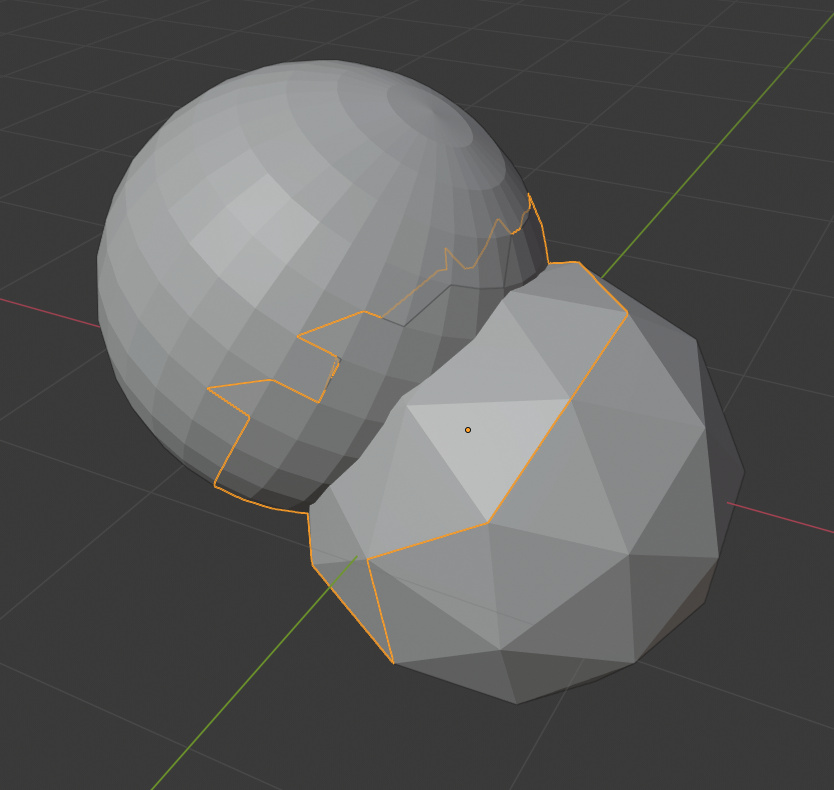

# CollisionDetection

Simple implementation of a mesh collision detection algorithm uaing pairwise pruning. Outputs candidate faces pairs from both meshes.

### Dependencies

* C++14 ready compiler 
* gtest (optional)

